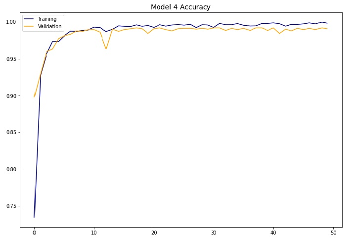
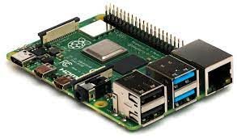

# Driver Drowsiness Detection System

## Introduction
Drowsiness is one of the biggest reasons for road accidents and Data Science is the best remedy for it. According to NHTSA statistics, the numbers of fatalities from drowsy drivers during the years are more than 1000 people being involved in accidents occured from drowsy condition. Drowsiness System is a safety technology that can prevent accidents caused by drivers who fell asleep while driving.

#### Problem Statement
As a data scientist, my job is building a Drowsiness Detection System to avoid accidents that may happen from drowsy drivers during long time of driving.

## Objectives

- The main objective of this project is to prepare a prototype of a driver drowsiness detection system  that trigger an alarm sound when the driver fell asleep.
- This is Achieved by using a camera which send multiple frames in second to my machine learning model, which get the eyes status and generate predictions based on the state of the driver’s eyes.

## Driver Drowsiness Detection Dataset
The dataset used for this model is downloaded from [MRL Eye Dataset](http://mrl.cs.vsb.cz/eyedataset). I separated them into their respective labels 'Open' or 'Close'. The data was cleaned and preprocessed for every image.
For the project were downloaded 37,000 images of different people's eyes (open or close) and were used 6840 images to train the model.

## Driver Detection System Work Procedure
In this project was used python library OpenCV for setting access to a camera and taking those images provided to feed in my Deep Learning Classifier Model which will classify whether the person's eyes are Open or close.
- #### Step 1: Take Image as input from a camera.
- #### Step 2: Detect the face in the image and create image with just the face.
- #### Step 3: Detect the eyes from new image and feed it to model.
- #### Step 4: Model will classify whether eyes are Open or Close.
- #### Step 1: Calculate score to check whether the person is drowsy.

## Model Architecture   
The model used was built with Keras using Convolutional Neural Networks (CNN) which performs very well for image classification. A CNN basically consists of an input layer, hidden layer which can have multiple layers as well and an output layer.
The CNN model architecture consists of the following layers:
- Convolutional Layer: 64 filters,  kernel_size = (3, 3)
 - MaxPool2D: pool_size = (2, 2)
- Convolutional Layer: 32 filters,  kernel_size = (3, 3)
  - MaxPool2D: pool_size = (2, 2)
- Convolutional Layer: 16 filters,  kernel_size = (3, 3)
    - MaxPool2D: pool_size = (2, 2)
- Flatten layer
- 2 Dense Layer: 128 nodes
- Output Layer (Dense): 1 nodes

A Relu activation function was used in all layers except the output layer which was used Sigmoid function.

## Model Performance
The Model used is "Model4.h5" with the following score:
- Sensitivity (Recall Score): 98.83%
- F1 Score: 99.1%

Confusion Matrix

Accuracy Performance

## Driver Detection System Execution
To be able to execute this system first you will need to download the "utils" folder which have all the python code you need to run this script, and Model ("model4.h5") from above.
Then run script with the following command:
- python "Live_Demo.py"
- Copy Ip and paste to your browser and click "Start Recording"

It may take some seconds to run and start Recording with your camera.
## Example Screenshot:

## Output Screenshot:

## Conclusions
In this project was built a Drowsy Detection System which alert the driver when he fell asleep by triggering an alarm sound. This System can reduce the road accidents that happens from Drowsy drivers which mean saving lives. This system is not very complex and works effectively. Also this system can be implemented to any automobile which have a Web Camera, Mini Computer like Raspberry pi and a Car Speaker.
1. Web Camera

2. Raspberry pi

3. Car Speaker

